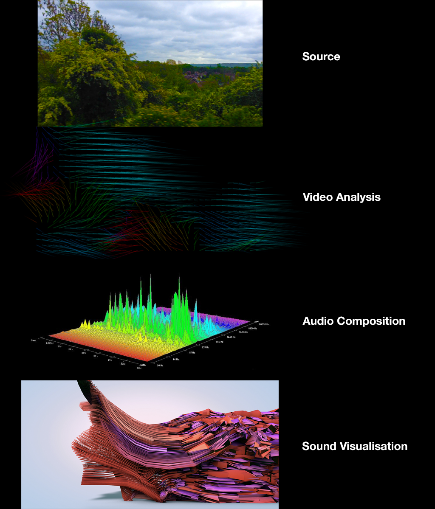

#Journey Composer

Journey Composer is a software concept which works with the relations between sound and visuals. It takes a video footage as its source and takes it through three stages of abstraction: first, uses group of video analysis methods then produces musical compositions from results of these analysis using automatic composition algorithms* and finally visualises sound from that generated music. 

It reads a given video source and generates rhythms by optical flow analyses and harmonics from colour frequencies of pixels among extendable other methods like mapping RGB values into midi notes.

The idea behind that application is a video footage which was taken during a train journey from Brighton to London, but it could be any video from a straight angle. The video provides a stream of scenes which always remind me of the sheet music. Therefore, I came up with the idea of building this software to prepare an album of songs of places between train stations. 

The final product could have 4 different visual representation of the process;   

- Source video  
- Video analysis outputs
- Algorithmic musical composition outputs
- Final sound visualisation**

---

*some sources on that concept,  
https://en.wikipedia.org/wiki/Mathematics_of_musical_scales  
http://computationalcreativity.net/iccc2012/wp-content/uploads/2012/06/160-Smith.pdf

**Image taken from http://futuredeluxe.co.uk/motion/files/d1bcb0df0d5ffd730768549e104cf306-57.html 

##Contact
  
Onur Uyar  
me@onuruyar.com